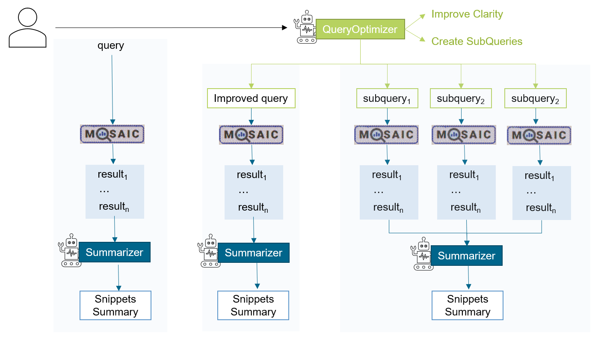

# MOSAIC-LLM

Main contributers:
Roxanne El Baff (roxanne.elbaff@dlr.de) and Valentin Edelsbrunner (v.edelsbrunner@protonmail.com)

## Overview
<p align="center">

</p>

The main goal of this demo is to use **Zero-shot LLM** to:

1. **Improve** and **expand** the `query` provided by the user using <span style="color:#B7D260">QueryOptimizer</span>.
2. **Summarize** the result snippets returned by MOSAIC using <span style="color:#00658B">Summarizer</span>.

The user provides a query, `q`. `q` is fed to a <span style="color:#B7D260">QueryOptimizer</span>, where it is improved and expanded with three additional queries. Then, using `q`, the improved query, and the three sub-queries, we search (via RESTAPI) using MOSAIC for each one of them and fetch the top N results - in total, we conduct five different searches (`q`, `improved_q`, `subquery_1`, `subquery_2`, `subquery_3`). After that, in the last phase, we feed the list of snippets to a <span style="color:#00658B">Summarizer</span>. We do this three times: For the `q` results, `improved_q` results, and the combined results of `subquery_1`+ `subquery_2`+`subquery_3`. The goal is to compare the three summaries and check if the optimized OR expanded queries positively impact the results.

##### Here is an example of the summaries for `q`: `Apple`


    **Original Query `q`**
    'The focus is on Apple. Apples are a type of pome fruit, which also includes pears, and grow on trees. They are in the same family as quinces. In the technology context, an applet is a computer program, often written in Java, that can be run in a web browser. In a different setting, the iodine test uses iodine as a chemical indicator to detect starch, and is used in various applications such as brewing beer and determining apple ripeness. In Greek mythology, Ladon is a dragon who guarded the golden apples in the Garden of the Hesperides.'

    **Improved Query**
    'The Apple T1 is a chip developed by Apple, derived from the Apple S2. Apple Inc. also produces the Apple Pencil, a wireless stylus pen accessory used with supported iPad tablets. Unrelated to Apple Inc., a pond-apple is a type of fruit that is not associated with the tech company or its products.'

    **Subquery_1-3**
    'Apple Inc. is an American company that produces personal computers, including the Apple Macintosh, and the Apple I, which was their first official product. Apple also offers the Apple Pencil, a wireless stylus pen accessory for use with supported iPad tablets. The Macintosh was one of the first computers to incorporate a graphical user interface, allowing users to point and click on icons using a mouse. Under the leadership of Steve Jobs, Apple Inc. has become a successful technology company, but specific financial performance details are not provided in the text snippets.'


Below, we explain each component in more details:

#### I. <span style="color:#B7D260">QueryOptimizer</span>
**Input**: a search `query` (e.g., Apple, Climate Change). 
**Output**: a `JSON` object with the following key and values:
- ``rationale``: Brief reasoning for your choices
- ``clarified_query``: The improved query
- ``subqueries``: An array of the top 3 sub-queries

**Approach**: 
- Zero-shot with an instruction-tuned LLM. 
- The prompt used is under `prompts/query_optimization.txt` [[link](prompts/query_optimization.txt)].
- **code**: [`MosaicLLM.optimize_query`](mosaic_llm/mosaicllm.py)

**Example Output** for `q`: `Apple`

```json

{
    'rationale': "The original query is too vague. I will clarify it to specify that the user is likely looking for information about Apple Inc., a major technology company. I will also create sub-queries to gather information about Apple's products, services, and company performance.",
    'clarified_query': 'Apple Inc.',
    'subqueries': ['Apple Inc. products',
                   'Apple Inc. services',
                   'Apple Inc. financial performance']
}

```

#### II. Calling MOSAIC
**Input**: A query as string
**Output**: a `list` containing to `n` text snippets

**Approach**: 
- We use [MOSAIC Rest API](https://qnode.eu/ows/mosaic/) which returns the top `n` results as JSON, where each item has the text snippet and other metadata.
  `https://qnode.eu/ows/mosaic/service/search?q={query}?&index={mosaic_index}&lang={lang}&limit={n}"`

- We postprocess the results from JSON to a list of strings containing only the text snippets.
- **code**: [`MosaicLLM.query_mosaic`](mosaic_llm/mosaicllm.py) and then [`MosaicLLM.extract_textsnippet_from_mosaic_response`](mosaic_llm/mosaicllm.py)
Check MOSAIC main page for further information.

#### III. <span style="color:#00658B">Summarizer</span>
**Input**: The list (as string) of top N text snippets returned from MOSAIC (II.) for a single query.
**Output**: a `string` containing the summary of the snippets

**Approach**: 
- Zero-shot with an instruction-tuned LLM. 
- The prompt used is under `prompts/result_summarization.txt.txt` [[link](prompts/result_summarization.txt)].
- **code**: [`MosaicLLM.summarize_results`](mosaic_llm/mosaicllm.py)
  
Check the overview section of an example of the three main outputs.

## Technical Details
**Model** ``open-mixtral-8x7b`` accessed via Mixtral API
**Temperature** default to ``0.7``
**Framework** LangChain
**Requirements** check [`requirements.txt` here](requirements.txt).
**Python version**: we tested the code with ``Python>3.9.2``

___

#### MosaicLLM Class

The main class [**`MosaicLLM`**](mosaic_llm/mosaillm.py) is implemented under the package [`mosaic_llm/mosaillm.py`](mosaic_llm/mosaillm.py). 

##### Attributes:
- ``model_name``: str - The model name of the LLM to be used for the Optimizer and Summarizer. Default value: ``open-mixtral-8x7b``.
  - Note: for now we only support Mistral models.
- ``temperature``: int - the temperature set when calling the LLM. Default value: ``0.7``.
- ``root``: str - The path root where the `prompts` folder is located. Default value:  `../`.

- ``mosaic_top_n``: int - The top N results that should be returned from MOSAIC. Default value: `5`.
- ``mosaic_index``: str - Defines the index name to be used when searching MOSAIC. Default value: ``demo-simplewiki``.
- ``mosaic_lang``: str - Defines the results' language returned from MOSAIC.. Default value: ``en``.


The main function, `run`, takes the query `q` and executes the whole pipeline. It returns a json object with the outputs from <span style="color:#B7D260">QueryOptimizer</span> and from <span style="color:#00658B">Summarizer</span>, in addition to the prompt string used for each of these modules.